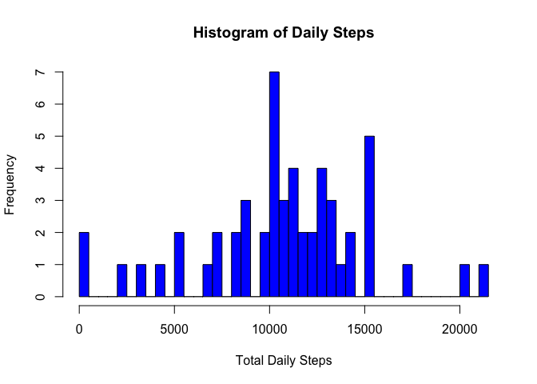

## Paul Ringsted
## 7th January 2019

## Loading and preprocessing the data

Loading the data and creating a subset without the NAs for initial analysis:


```r
data_raw <- read.csv("activity.csv")
data <- data_raw[which(!is.na(data_raw$steps)),]
```

Load statistics:

* 17568 rows loaded

* 15264 rows processed without NA

* 570608 total steps in dataset [control total]

## What is mean total number of steps taken per day?

Summarizing the total steps per day for histogram plot, calculating median and mean:


```r
data_sum <- aggregate(data$steps,by=list(data$date),FUN="sum")
colnames(data_sum) <- c("date","steps")
median_steps <- as.integer(median(data_sum$steps))
mean_steps <- as.integer(mean(data_sum$steps))
total_steps <- as.integer(sum(data_sum$steps))
hist(data_sum$steps,breaks=50,col='blue',main="Histogram of Daily Steps",xlab="Total Daily Steps")
```

<!-- -->

Summary of total steps per day:

* 570608 total steps in summarized dataset [control total]

* 10765 median steps/day

* 10766 mean steps/day


## What is the average daily activity pattern?

Plotting average steps per 5-minute internal over all days:


```r
data_act <- aggregate(data$steps,by=list(data$interval),FUN="mean")
colnames(data_act)<-c("interval","avg_steps")

max_avg_steps <- max(data_act$avg_steps)
max_interval <- data_act[which(data_act$avg_steps==max_avg_steps),]$interval

plot(x=data_act$interval,y=data_act$avg_steps,type='l',xlab="Interval (mins)",ylab="Average Steps",col="blue",main="Average Number of Steps Per 5-Min Interval")
```

<!-- -->

5-minute interval with max average steps: 835 (206.1698113 steps)

## Imputing missing values

Create a dataset imputing the original missing (NA) values using the average steps for each interval recorded as NA

Rows with missing data (NA): 2304


```r
# Get the bad rows we excluded from the data, fill in NA with mean steps for that interval
data_bad <- data_raw[which(is.na(data_raw$steps)),]
for(i in 1:nrow(data_bad)) {
        data_bad[i,]$steps <-
                data_act[which(data_act$interval == data_bad[i,]$interval),]$avg_steps
}
data_imp <- rbind(data,data_bad)

# Create a dataset of any remaining NAs as a check - should be none
still_bad <- data_imp[which(is.na(data_imp$steps)),]

# Redo the summarization for the imputed dataset
data_sum_imp <- aggregate(data_imp$steps,by=list(data_imp$date),FUN="sum")
colnames(data_sum_imp) <- c("date","steps")
median_steps_imp <- as.integer(median(data_sum_imp$steps))
mean_steps_imp <- as.integer(mean(data_sum_imp$steps))
total_steps_imp <- as.integer(sum(data_sum_imp$steps))

#Figure out how much these changed from the original dataset without NAs
median_steps_imp_pct <- round(100*(median_steps_imp-median_steps)/median_steps,1)
mean_steps_imp_pct <- round(100*(mean_steps_imp-mean_steps)/mean_steps,1)
total_steps_imp_pct <- round(100*(total_steps_imp-total_steps)/total_steps,1)

hist(data_sum_imp$steps,breaks=50,col='blue',main="Histogram of Daily Steps with NAs Imputed from Mean Steps for the Interval",xlab="Total Daily Steps")
```

<!-- -->

Summary of imputed data set:

* 2304 observations imputed

* 17568 rows in final imputed dataset, 0 rows remaining with NA steps

* 656737 total steps vs. 570608 with NAs removed (15.1% impact)

* 10766 median steps/day imputed vs. 10765 with NAs removed (0% impact)

* 10766 mean steps/day imputed vs. 10766 with NAs removed (0% impact)

Conclusion - imputing the NA values in the dataset has little or no difference on the median and mean daily steps (as expected since imputed values were based on mean), though has large impact (15.1%) on total number of steps

## Are there differences in activity patterns between weekdays and weekends?

Adding factor for Weekday vs. Weekend days to look at difference in average steps per interval for each case:


```r
data_imp$weekend <- factor(grepl("S(at|un)",weekdays(as.Date(data_imp$date),abbr=TRUE)))

data_wk <- aggregate(data_imp$steps,by=list(data_imp$interval,data_imp$weekend),FUN="mean")
colnames(data_wk)<-c("interval","weekend","avg_steps")

library('ggplot2')
to_weekend<-as_labeller(c(`FALSE` = "Weekday",`TRUE` = "Weekend"))
g <- ggplot(data_wk,aes(interval,avg_steps)) + geom_line()
g <- g+ facet_grid(rows = vars(weekend), labeller=to_weekend)
g <- g + labs(x="Interval (mins)",y="Average Steps")
g <- g + labs(title = "Average Number of Steps Per Interval, Weekend vs. Weekday view")
print(g)
```

<!-- -->
